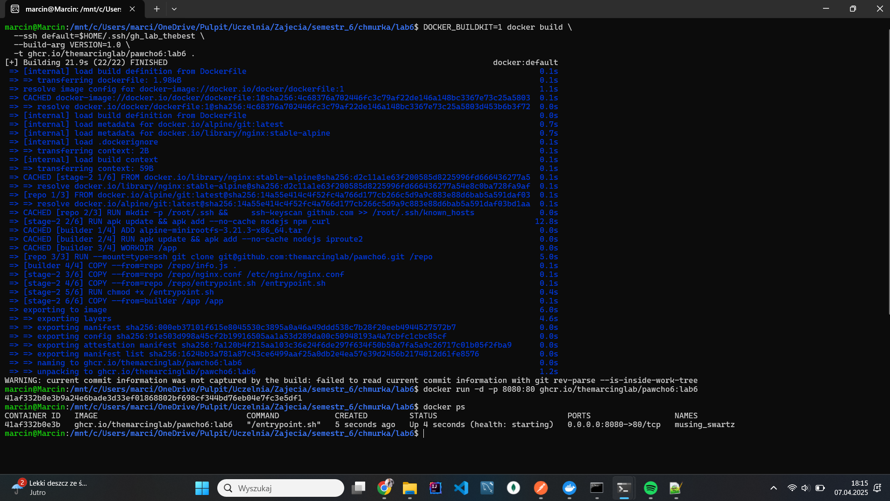

Polecenie do zbudowania obrazu:

DOCKER_BUILDKIT=1 docker build \
  --ssh default=$HOME/.ssh/gh_lab_thebest \
  --build-arg VERSION=1.0 \
  -t ghcr.io/themarcinglab/pawcho6:lab6 .

Polecenie do uruchomienia obrazu:

docker run -d -p 8080:80 ghcr.io/themarcinglab/pawcho6

